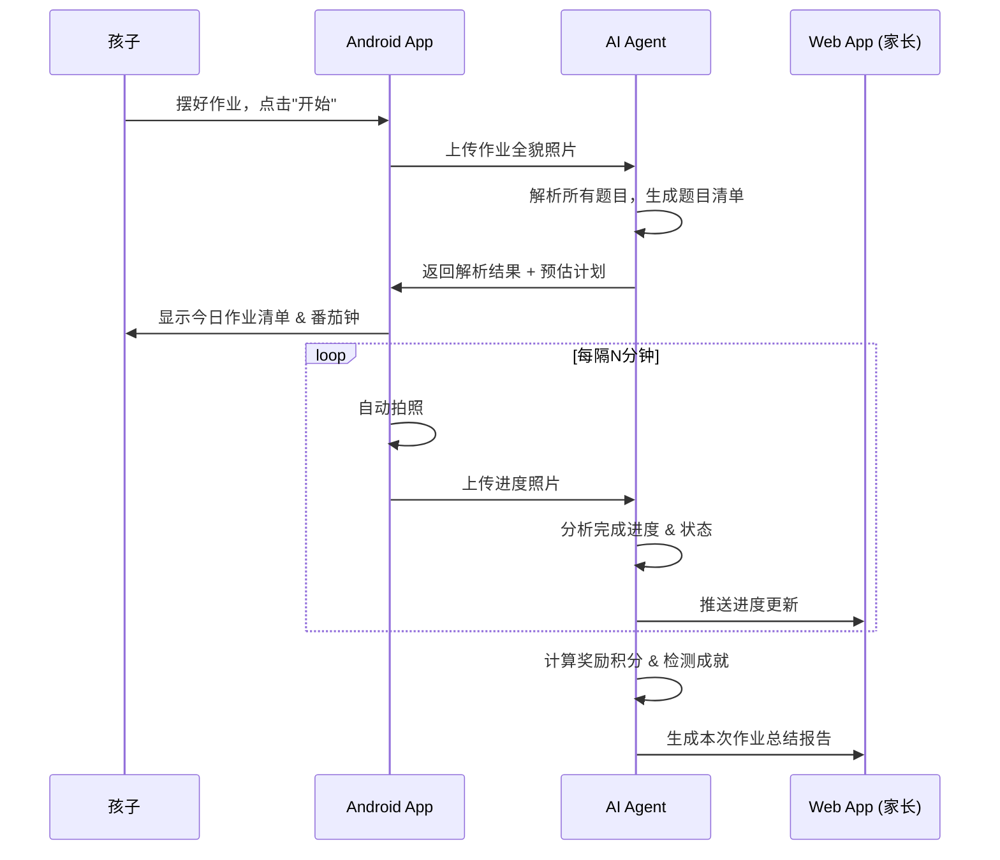

# 小学生作业实时监控系统 — 产品规格说明书

> **版本**: v0.3 (全功能)
> **日期**: 2026-03-22
> **状态**: Phase 1-3 全部实现完毕

---

## 1. 产品愿景

让孩子通过 **看见自己的进度、不断攻克题目** 的过程，逐渐建立「我能行」的自信，养成高效自主的学习习惯。家长 **无需全程陪坐**，仅在进度明显落后时收到提醒。

> [!IMPORTANT]
> **核心哲学**：督促不是目的。目的是让孩子感受到「我能够攻克很多作业」，从而逐渐自信、高效。系统是 **成长助手** 而非监控工具。

---

## 2. 系统组成

| 组件 | 形态 | 核心职责 | 实现状态 |
|------|------|----------|----------|
| **Android App** | 手机架在高拍仪上，**静默运行** | 作业拍照录入、定时双模式采集、音频反馈、离线缓存 | ✅ 已实现 |
| **AI Agent** | 云端服务 (Gemini 2.5 Flash) | 题目解析、进度追踪、效率分析、异常检测、Diff 判定 | ✅ 已实现 |
| **Web App** | 浏览器端（手机/平板/电脑） | 孩子进度 + 家长看板 + 报告 + 趋势 + 设置 | ✅ 已实现 |

### 系统交互流程



---

## 3. 用户角色

| 角色 | 说明 |
|------|------|
| **孩子** | 小学1-6年级学生，主要与 Android App 交互 |
| **家长** | 通过 Web App 查看报告和设置，不需要全程在场 |

---

## 4. 功能模块详述

### 4.1 Android App

#### 4.1.1 作业录入 ✅

| 功能项 | 说明 | 实现 |
|--------|------|------|
| 每日批次 | 作业以 **天** 为单位组织 | `SessionViewModel` |
| 分页拍照 | 逐页拍照，每张照片对应一页作业 | `CaptureViewModel.captureAndUploadPage()` |
| 多页连拍 | 连续拍摄不同科目/页面，绑入同一 Session | `CaptureViewModel` 累计页面列表 |
| 补录支持 | 开始写作业后仍可随时补拍新的作业页 | `CaptureScreen` |
| 清晰度检测 | 自动检测照片是否模糊 | `ImageQualityChecker` |
| AI 识别确认 | 解析结果供确认，支持手动增删题目 | `ReviewQuestionsSheet` |

#### 4.1.2 实时采集（高拍仪模式）✅

| 功能项 | 说明 | 实现 |
|--------|------|------|
| 双模式采集 | 高分辨率照片 + 短视频 | `CaptureService.performCapture()` |
| 定时采集 | 可配置间隔（默认 3 分钟） | `CaptureTimer` |
| 遮挡检测 | 检测画面被遮挡，跳过该帧 | `ImageQualityChecker` |
| 模糊检测 | 检测画面模糊，降级处理 | `ImageQualityChecker` |
| 离线缓存 | 网络中断时缓存到 Room，恢复后补传 | `PendingUpload` + `UploadWorker` |
| 前台服务 | WakeLock + Notification 保活 | `CaptureService` + `KeepAliveHelper` |

#### 4.1.3 音频反馈（静默模式）✅

| 功能项 | 说明 | 实现 |
|--------|------|------|
| 番茄钟音效 | 休息结束轻提示音 | `CaptureService.playBreakEndSound()` |
| 轮次小结语音 | TTS 播报完成情况 | `CaptureService.speak()` |
| 无屏幕 UI | 屏幕可关闭，无需视觉界面 | 前台服务模式 |

---

### 4.2 AI Agent ✅

#### 4.2.1 作业解析

| 功能项 | 实现 |
|--------|------|
| 题目识别 | `onPageCreated` → `PAGE_PARSE_PROMPT` → Gemini |
| 题型分类 | 7 种题型（填空/选择/计算/应用题/抄写/阅读/其他） |
| 工作量预估 | `estimatedMinutes` 基于小学生平均速度 |
| 取景坐标 | `boundingBox` 归一化坐标 (0-1) |

#### 4.2.2 进度追踪

| 功能项 | 实现 |
|--------|------|
| 完成检测 | `onCaptureCreated` → `buildProgressPrompt` → Gemini 对比 |
| Diff 判定 | `buildDiffDetectionPrompt` — boundingBox 级笔迹检测 |
| 进度百分比 | 实时计算并写入 session |
| 题目状态机 | `unanswered → in_progress → completed` |

#### 4.2.3 异常检测

| 功能项 | 实现 |
|--------|------|
| 长时间无进度 | `shouldNotifyParentForLag()` → FCM 推送 |
| 长时间离开 | `shouldNotifyParentForLeave()` → FCM 推送 |
| 频繁擦除 | Gemini anomalies 检测 |

#### 4.2.4 效率分析

| 功能项 | 实现 |
|--------|------|
| 单题用时 | `actualMinutes` per question |
| 效率星级 | `calculateStars()` (1-5 星) |
| 预估 vs 实际 | `determinePlanStatus()` |
| 效率趋势 | Web `EfficiencyChart` + `useHistory` |

#### 4.2.5 反馈系统

| 进度状态 | 推送给孩子 | 推送给家长 | 实现 |
|----------|-----------|------------|------|
| 领先 | 鼓励 | 不打扰 | `generateChildFeedback()` |
| 同步 | 平稳 | 不打扰 | `generateChildFeedback()` |
| 轻微落后 | 温和提醒 | 不打扰 | `generateChildFeedback()` |
| 明显落后 | 鼓励 | **推送通知** | `sendNotification()` |
| 长时间离开 | — | **推送通知** | `sendNotification()` |

---

### 4.3 Web App ✅

#### 4.3.0 孩子进度页 `/child`

| 功能项 | 实现 |
|--------|------|
| 进度赛跑条 | `ProgressRaceBar` 双轨竞速 |
| 完成数 | 大字显示已完成/总题数 |
| 领先/落后提示 | 动态文案 |

#### 4.3.1 实时看板 `/`

| 功能项 | 实现 |
|--------|------|
| 一句话状态 | `StatusBanner` |
| 进度赛跑图 | `ProgressRaceBar` |
| 预计完成时间 | `estimateCompletion()` |
| 异常事件流 | 事件列表 |
| 导航栏 | 报告/趋势/设置/孩子视图 |

#### 4.3.2 作业报告 `/report/[sessionId]`

| 功能项 | 实现 |
|--------|------|
| 每次作业总结 | AI 总结 + 亮点 + 建议 |
| 奖励展示 | 积分、成就徽章、个人最佳 |
| 题目详情 | `QuestionList` 每题状态/用时 |
| 时间线回放 | `Timeline` 按时间轴展示快照 |

#### 4.3.3 效率趋势 `/trends`

| 功能项 | 实现 |
|--------|------|
| 趋势图 | `EfficiencyChart` (Recharts) |
| 星级趋势 | Area Chart |
| 完成率趋势 | Area Chart |
| 统计汇总 | 作业次数/平均星级/平均完成率 |
| 历史列表 | 可点击跳转报告 |

#### 4.3.4 设置管理 `/settings`

| 功能项 | 实现 |
|--------|------|
| 番茄钟配置 | 工作/休息时长 |
| 拍照频率 | 采集间隔 |
| 通知偏好 | 3 个开关（落后/离开/完成） |

---

## 5. 关键场景处理

### 5.1 图像质量问题

| 情况 | 处理策略 | 实现 |
|------|----------|------|
| 照片模糊 | 标记"低质量帧"，等待下一次清晰采集 | `ImageQualityChecker` + `onCaptureCreated` skip |
| 遮挡 | 跳过该帧 | `quality === "occluded"` |
| 铅笔字迹浅 | Gemini 综合判断 | prompt 指令 |

### 5.2 网络中断

| 策略 | 实现 |
|------|------|
| 本地队列 | `PendingUpload` Room entity |
| 恢复补传 | `UploadWorker` + WorkManager |
| 时间排序 | `capturedAt ASC` |

### 5.3 L4 自动驾驶 + L2 兜底

| 场景 | 实现 |
|------|------|
| AI 自动进度检测 | `buildDiffDetectionPrompt` Diff |
| 手动打卡兜底 | `ReviewQuestionsSheet` 手动完成按钮 |

---

## 6. 番茄工作法集成 ✅

```
┌─────────────────────────────────────────────────┐
│             一次作业 Session                      │
├────────┬────────┬────────┬────────┬──────────────┤
│ 🍅 每题 │ ☕ 题间 │ 🍅 每题 │ ☕ 题间 │ 🍅 每题 ...  │
│ 专注写  │  休息  │ 专注写  │  休息  │  专注写      │
└────────┴────────┴────────┴────────┴──────────────┘
```

- `PomodoroTimerViewModel` 控制 | `PomodoroTimerDisplay` 展示
- `CaptureService.speak()` TTS 休息播报
- 家长可通过 `/settings` 配置时长

---

## 7. 激励机制 ✅

| 机制 | 说明 | 实现 |
|------|------|------|
| 超越计划奖 | 每题 +2 积分 | `rewards.ts: aheadBonus` |
| 提前完成奖 | 比预估快 20%+ → +10 分 | `rewards.ts: earlyFinishBonus` |
| 连续领先 | 3 次/5 次解锁成就 | `checkAchievements()` |
| 个人最佳 | 效率超历史最佳 → +15 分 | `checkPersonalBest()` |
| 效率星级 | 1-5 星 | `calculateStars()` |
| 积分累计 | 写入 `users/{userId}.totalPoints` | `onSessionCompleted` |

> [!TIP]
> 所有激励都基于 **「和自己的计划比」** 而非和其他孩子比，避免不健康的竞争心态。

---

## 8. 体验与设计原则

1. **成长型心智** — 强调「你完成了、你进步了、你超越了」
2. **助手而非监视** — 绝不使用「监控」「检查」等词汇
3. **正面反馈为主** — 鼓励频率远高于提醒，绝不使用惩罚性语气
4. **不打断专注** — 声音/语音提示柔和不突兀
5. **数据安全** — `scheduledCleanup` 30 天自动删除采集数据
6. **家长可控** — 所有参数由家长在 `/settings` 设定

---

## 9. 已确认事项

| 项目 | 决定 |
|------|------|
| 拍照间隔 | **3 分钟**，可在设置中调整 |
| Agent 分析延迟 | **不敏感**，异步架构 |
| 账号体系 | **Firebase 匿名认证**，自动登录 |
| 录入流程 | **分页拍，多页连拍**，支持补录 |
| 采集模式 | **照片 + 视频同时拍摄** |
| 离线策略 | **Room + WorkManager** 自动补传 |
| 数据清理 | **30 天自动清理 capture，90 天清理 page** |

---

## 10. 测试覆盖

```
Cloud Functions: 81 tests / 7 suites ✅
Web App:         26 tests / 3 suites ✅
总计:            107 tests / 10 suites ✅
```

> [!NOTE]
> 高拍仪自动化和 AI 云端进度对比，是本产品的最终极目标与最大的差异化！不可丢失。
