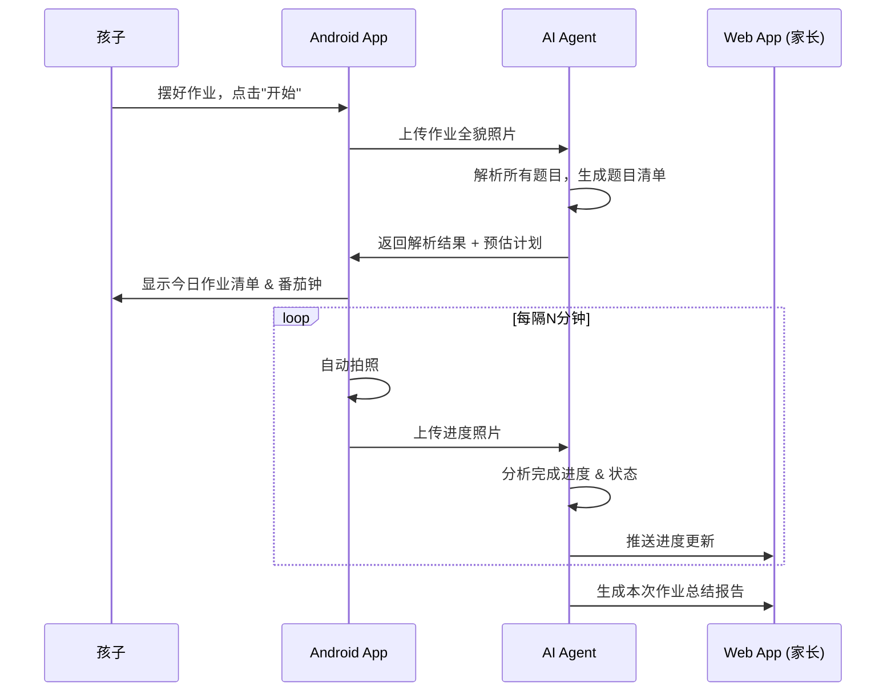

# 小学生作业实时监控系统 — 产品规格说明书

> **版本**: v0.2 草案  
> **日期**: 2026-03-16  

---

## 1. 产品愿景

让孩子通过 **看见自己的进度、不断攻克题目** 的过程，逐渐建立「我能行」的自信，养成高效自主的学习习惯。家长 **无需全程陪坐**，仅在进度明显落后时收到提醒。

> [!IMPORTANT]
> **核心哲学**：督促不是目的。目的是让孩子感受到「我能够攻克很多作业」，从而逐渐自信、高效。系统是 **成长助手** 而非监控工具。

---

## 2. 系统组成

| 组件 | 形态 | 核心职责 |
|------|------|----------|
| **Android App** | 手机架在高拍仪上，**静默运行** | 作业拍照录入、定时双模式采集、音频反馈、本地缓存 |
| **AI Agent** | 云端服务 (Gemini 2.5 Flash) | 题目解析、进度追踪、效率分析、异常检测 |
| **Web App** | 浏览器端（手机/平板/电脑） | 孩子休息时看进度 + 家长省心看板 + 报告 |

### 系统交互流程



---

## 3. 用户角色

| 角色 | 说明 |
|------|------|
| **孩子** | 小学1-6年级学生，主要与 Android App 交互 |
| **家长** | 通过 Web App 查看报告和设置，不需要全程在场 |

---

## 4. 功能模块详述

### 4.1 Android App

#### 4.1.1 作业录入

| 功能项 | 说明 |
|--------|------|
| 每日批次 | 作业以 **天** 为单位组织，每天是一个全新批次，不论前一天是否完成 |
| 分页拍照 | 逐页拍照，每张照片对应一页作业 |
| 多作业本支持 | 可连续拍摄不同科目/作业本的内容 |
| 补录支持 | 开始写作业后仍可随时补拍新的作业页，未完成的也可重新拍照录入 |
| 预览确认 | 拍完后展示缩略图，确认照片清晰度足够 |
| 重拍机制 | 对模糊/不清晰的照片提示重拍 |
| 清晰度检测 | **自动检测**照片是否模糊，不合格时提示重新拍摄 |
| **异步解析等待** | AI 多模态大模型解析密集试卷需要 30~60 秒，期间提供友好的“正在分析” UI 与防卡死倒计时 |
| **AI 识别确认与微调** | 解析出特定数量（如 13 题）后，提供列表供确认。**默认同意进入作业**；但也支持手动合并拆错的题目或自定题数 |

#### 4.1.2 实时采集（高拍仪模式）✅ MVP

| 功能项 | 说明 |
|--------|------|
| **双模式采集** | 每次采集同时拍摄 **高分辨率照片 + 短视频**，照片用于精确 OCR，视频用于动态场景理解 |
| 定时采集 | 可配置间隔时间（默认 3 分钟），自动触发双模式采集 |
| 智能采集 | （进阶）检测到画面变化较大时才触发采集，节省资源 |
| 遮挡检测 | 检测到画面被遮挡（如人头挡住）时，标记该帧为"遮挡"，不发送给 Agent |
| 模糊检测 | 检测到画面模糊时，标记为"低质量"，Agent 降级处理 |
| 视角偏移预警 | 检测到手机被碰歪（画面角度突变），发出提醒 |
| 本地缓存 | 网络中断时自动缓存，恢复后补传 |
| 省电模式 | 长时间运行优化：降低屏幕亮度、合理管理后台 |

#### 4.1.3 音频反馈（静默模式）

> [!IMPORTANT]
> Android 手机架在高拍仪上，**孩子看不到屏幕**。所有反馈通过轻柔音频传达，不打断专注。

| 功能项 | 说明 |
|--------|------|
| 番茄钟音效 | 番茄钟结束时播放轻柔提示音，提醒休息 |
| 轮次小结语音 | 每个番茄钟结束时，用 TTS 轻声播报：「这一轮你完成了 3 题，太棒了！」 |
| 休息结束提示 | 休息结束时轻提示音，提醒继续 |
| 无屏幕 UI | 运行时屏幕可关闭/最低亮度，无需任何视觉界面 |

> [!NOTE]
> 孩子在番茄钟休息时间，可以通过 **Web App 的孩子进度页**（手机/平板浏览器）查看详细进度。

---

### 4.2 AI Agent

#### 4.2.1 作业解析（核心）

| 功能项 | 说明 |
|--------|------|
| 题目识别 | 从照片中识别出每道题目，**以题为颗粒度** |
| 题目编号 | 为每道题分配唯一编号（如 `语文-P12-第3题`） |
| 题型分类 | 识别题型：填空、选择、计算、应用题、抄写、阅读理解等 |
| 工作量预估 | 根据题型和数量，预估每道题的完成时间，输出 `estimatedMinutes`。**这是赛车进度条和番茄钟运转的底层燃料** |
| 取景坐标定位 | 返回 `boundingBox` 取景坐标，为后续可能的题目切片显示防呆做准备 |
| 总计划生成 | 自动累计总预估耗时，供“进度预期赛车”匀速使用 |

> [!IMPORTANT]
> 所有追踪和分析都以 **单道题目** 为最小颗粒度，而非学科级别。

#### 4.2.2 进度追踪 ✅ MVP核心

| 功能项 | 说明 |
|--------|------|
| 完成检测 | 对比前后照片，判断哪些题目已被作答 |
| 进度百分比 | 实时计算总体完成百分比和各题状态 |
| 题目状态机 | 每题的状态：`未作答` → `作答中` → `已完成` |
| 作业本切换检测 | 当检测到新的作业页面出现时，自动关联到对应的题目集 |
| 图像质量处理 | 区分"真的没做"和"照片质量不够无法判断"，避免误报 |

#### 4.2.3 异常检测

| 功能项 | 说明 |
|--------|------|
| 长时间无进度 | 某道题停留过久（超过预估时间 2 倍），标记为"可能遇到困难" |
| 长时间离开 | 作业区域长时间无变化 + 无人影，判断为离开 |
| 频繁擦除 | 检测到同一区域反复修改，可能表示不确定/困惑 |

> [!NOTE]
> Agent **不做对错判断**（v1 版本），仅判断"是否已作答"。未来版本可考虑加入正确性分析。

#### 4.2.4 效率分析

| 功能项 | 说明 |
|--------|------|
| 单题用时统计 | 记录每道题从开始到完成的用时 |
| 番茄钟效率 | 每个番茄钟内完成的题目数 |
| 预估 vs 实际 | 对比预估时间和实际用时的差异 |
| 效率趋势 | 跨天/跨周的效率变化趋势 |

#### 4.2.5 进度驱动反馈（核心）

Agent 持续计算「实际进度」vs「预估计划线」的差值，并生成不同级别的反馈：

| 进度状态 | 差值 | 推送给孩子 | 推送给家长 |
|----------|------|-----------|------------|
| 领先 | 实际 > 计划 | 鼓励：「太棒了，你超前了！」 | 不打扰 |
| 同步 | 实际约等于计划 | 平稳：「节奏很好，继续保持」 | 不打扰 |
| 轻微落后 | 落后 2-3 题 | 温和提醒：「加把劲，你能追上的」 | 不打扰 |
| 明显落后 | 落后 > 3 题或停滞 > 10分钟 | 鼓励 + 建议休息/换科目 | **推送通知** |
| 异常 | 长时间离开/无法判断 | — | **推送通知** |

---

### 4.3 Web App（双视角：孩子 + 家长）

> [!IMPORTANT]
> Web App 同时服务孩子和家长两个角色，通过不同页面区分。

#### 4.3.0 孩子进度页（番茄钟休息时看）

> 孩子在番茄钟休息时，用手机/平板浏览器打开这个页面，一眼看到自己的进度。

| 功能项 | 说明 |
|--------|------|
| **进度赛跑条** | **双轨竞速赛车设计**<br>深色车(实际进度)：直接反映被攻克的总题数。<br>浅色车(预期进度)：**纯时间驱动**（已流逝时间 / 总预估时间 * 总题数）。实现时间与动作的真实脱钩竞速！ |
| 完成数 | 大字显示「已完成 12 / 20 题」 |
| 领先/落后提示 | 「你跑赢了时间！比计划快了 2 题！🎉」或「加油，还差 1 题追上计划 💪」 |
| 小成就动画 | 超越计划时显示庆祝动画 |
| 极简设计 | 只有进度条和数字，**不放任何分散注意力的元素** |

#### 4.3.1 实时看板

| 功能项 | 说明 |
|--------|------|
| 一句话状态 | 顶部大字显示：「进度正常，已完成 12/20 题」或「进度落后，已停滞 15 分钟」 |
| 进度赛跑图 | 与孩子端相同的双轨进度条（计划 vs 实际），家长一眼看懂 |
| 预计完成时间 | 基于当前速度预估的完成时间 |
| 异常事件流 | 仅展示需要关注的事件（停滞、离开、明显落后），正常进展不显示 |
| 实时照片 | 可查看最近一张采集照片（隐私可配置） |

#### 4.3.1.1 家长推送通知

| 事件 | 推送内容 | 默认开关 |
|------|----------|----------|
| 进度明显落后 | 「小明作业进度落后较多，已停滞 15 分钟」 | 开 |
| 作业全部完成 | 「小明今天作业全部完成！用时 52 分钟」 | 开 |
| 长时间离开 | 「小明已离开作业区域 10 分钟」 | 开 |
| 进度正常更新 | — | 关（不打扰） |

#### 4.3.2 作业报告

| 功能项 | 说明 |
|--------|------|
| 每次作业总结 | 总用时、有效用时、完成题数、效率评分 |
| 时间线回放 | 按时间轴展示每个节点的进度快照 |
| 单题详情 | 每道题的用时、状态、是否遇到困难 |
| 效率趋势图 | 按天/周/月的效率趋势 |

#### 4.3.3 设置管理

| 功能项 | 说明 |
|--------|------|
| 番茄钟配置 | 工作时长、休息时长、轮次 |
| 拍照频率 | 调整 Android App 的采集间隔 |
| 通知偏好 | 选择哪些事件触发通知（异常/完成/进度更新） |

---

## 5. 关键场景处理

### 5.1 图像质量问题

| 情况 | 处理策略 |
|------|----------|
| **照片模糊** | Agent 标记为"低质量帧"，等待下一次清晰采集，不做进度判断 |
| **人头/身体遮挡** | Android 端检测大面积遮挡，跳过该帧；Agent 端用前后帧插值推断 |
| **光线不足/过曝** | Android 端提醒调整灯光；Agent 端尝试图像增强后识别 |
| **手机被碰歪** | Android 端检测视角突变，发出声音/通知提醒复位 |
| **铅笔字迹浅** | Agent 使用图像增强 + 多模态模型的综合判断能力 |

### 5.2 作业本切换

| 步骤 | 说明 |
|------|------|
| 1 | Agent 检测到当前画面与已知题目集不匹配 |
| 2 | 尝试与其他已录入的作业页面匹配 |
| 3 | 如果匹配成功，切换到对应的题目追踪上下文 |
| 4 | 如果是全新页面（未录入），提示孩子补充录入 |

### 5.3 网络中断

| 策略 | 说明 |
|------|------|
| 本地队列 | Android 端维护上传队列，断网时持续拍照存本地 |
| 恢复补传 | 网络恢复后按时间顺序补传 |
| Agent 补分析 | Agent 收到批量迟到帧后，跳帧分析关键节点 |

### 5.4 L4 级“自动驾驶”与 L2 级手动接管 (兜底交互)

| 场景 | 说明 |
|------|------|
| **AI 视觉被欺骗** | 尽管终极目的是高拍仪 100% 自动采集并判断（L4自动驾驶），但在初期或照片极度模糊导致云端无法判定某个勾的有效性时，进度可能会假死。 |
| **随时可用的人工介入** | Android 端的进度面板必须永远保留一个**「单题列表及✅ 手动完成 / 撤销按钮」**。允许孩子随时点击物理按钮超车 AI（L2手动接管）。这是容错性最高的方案。 |

---

## 6. 番茄工作法集成

```
┌─────────────────────────────────────────────────┐
│             一次作业 Session                      │
├────────┬────────┬────────┬────────┬──────────────┤
│ 🍅 每题 │ ☕ 题间 │ 🍅 每题 │ ☕ 题间 │ 🍅 每题 ...  │
│ 专注写  │  休息  │ 专注写  │  休息  │  专注写      │
└────────┴────────┴────────┴────────┴──────────────┘
  ↑                  ↑                  ↑
  自动检测进度        检测过题          追踪用时
```

- **按题追踪**：打破传统 25 分钟倒计时束缚，自动判断单题耗时并给予鼓励。
- Agent 根据题目总量自动计算整体时间和所需的休息轮番。
- 每个完成节点提供语音"本题/本轮小结"。

---

## 7. 激励机制（围绕「超越计划」）

| 机制 | 说明 |
|------|------|
| 超越计划奖 | 每次作业中跑赢计划线，获得额外积分 |
| 提前完成奖 | 比预估总时间更快完成全部作业，获得大奖励 |
| 连续领先 | 连续 3 次作业都跑赢计划，解锁特殊成就 |
| 个人最佳 | 打破自己的历史最快记录时，特别庆祝 |
| 效率星级 | 每次作业根据「领先计划的幅度」给 1-5 星 |
| 积分系统 | 可与已有 Web App 的奖励系统对接 |

> [!TIP]
> 所有激励都基于 **「和自己的计划比」** 而非和其他孩子比，避免不健康的竞争心态。

---

## 8. 体验与设计原则

1. **成长型心智** — 强调「你完成了、你进步了、你超越了」，让孩子建立「我能行」的信念
2. **助手而非监视** — 界面和语言全部用「学习助手」角度，绝不使用「监控」「检查」等词汇
3. **正面反馈为主** — 鼓励和表扬的频率远高于提醒，绝不使用惩罚性语气
4. **不打断专注** — 所有声音/语音提示必须柔和不突兀，绝不在孩子专注写作业时发出干扰性声音。番茄钟结束用轻柔音效，进度反馈优先用视觉（屏幕动画）而非声音
5. **数据安全** — 照片和视频数据加密存储，家长可设定保留时长
6. **家长可控** — 所有参数由家长在 Web App 设定

---

## 9. MVP 范围（v1）

### ✅ 包含

- Android App：作业拍照录入 + 定时采集 / 手动录入 + 分题番茄钟
- AI Agent：题目极速解析 + 进度追踪 + 效率分析 + 异常检测
- Web App：实时看板 + 作业报告

### ❌ 不包含（后续版本）

- 作业正确性判断
- 语音交互
- 难度自适应
- 多孩子支持
- 历史大数据分析
- iOS App

---

## 10. 已确认事项

| 项目 | 决定 |
|------|------|
| 拍照间隔 | **3 分钟**，确认合适，作为自动化进度的核心钩子 |
| Agent 分析延迟 | **不敏感**，无需实时，后端可采用异步架构 |
| 账号体系 | **复用已有 Web App 的账号体系**，一套账号贯穿所有端 |
| 录入流程 | **分页拍**，以天为批次，支持后续补录，未完成的可重新拍照 |
| 采集模式 | **照片 + 视频同时拍摄**，照片高分辨率用于精确识别，视频用于动态场景理解 |

> [!NOTE]
> 高拍仪自动化和 AI 云端进度对比，是本产品的最终极目标与最大的差异化！不可丢失。
