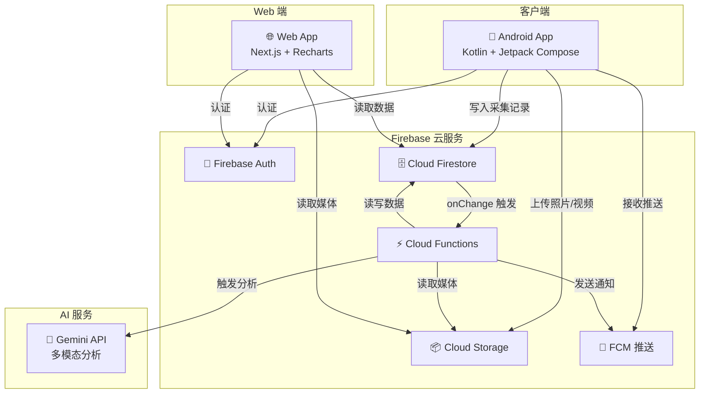
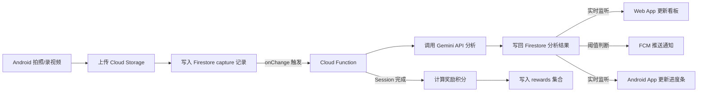
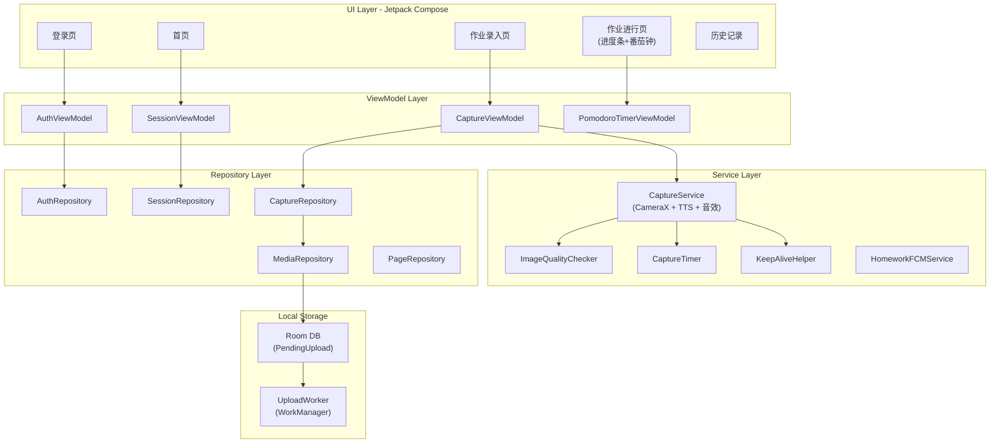

# 技术架构设计 — 小学生作业成长助手

> **版本**: v2.0
> **日期**: 2026-03-22
> **状态**: Phase 1-3 全部实现完毕
> **基于**: [产品规格说明书 v0.3](product_spec.md)

---

## 1. 整体系统架构



### 核心数据流



---

## 2. 技术栈选型

| 层级 | 技术 | 理由 |
|------|------|------|
| **Android App** | Kotlin + Jetpack Compose | 现代 Android 开发标准，声明式 UI |
| **Android 相机** | CameraX | Google 官方相机库，支持拍照+录像，简化生命周期 |
| **Android 本地存储** | Room + WorkManager | 离线缓存队列 + 后台上传任务 |
| **后端认证** | Firebase Auth | 匿名认证，自动登录 |
| **数据库** | Cloud Firestore | 实时同步、离线支持、按文档付费 |
| **文件存储** | Cloud Storage for Firebase | 大文件（照片/视频）存储 |
| **云函数** | Cloud Functions (Node.js/TypeScript) | 事件驱动，Firestore onChange 触发 |
| **AI 分析** | Gemini 2.0 Flash API | 多模态（图片+视频），快速且成本低 |
| **推送通知** | Firebase Cloud Messaging (FCM) | Android + Web 统一推送 |
| **Web App** | Next.js + React | SSR/SSG 支持，与 Firebase 集成良好 |
| **Web 图表** | Recharts | 轻量级 React 图表库，用于效率趋势图 |
| **Web 测试** | Vitest + Testing Library | 快速、兼容 Next.js |
| **CF 测试** | Jest + ts-jest | TypeScript 第一类支持 |

---

## 3. 数据模型设计（Firestore）

### 3.1 集合结构总览

```
users/{userId}
├── profile (文档字段)
├── settings (文档字段)
├── totalPoints (文档字段)            // 激励系统累计积分
│
├── sessions/{sessionId}           // 每日作业 Session
│   ├── pages/{pageId}             // 录入的作业页
│   ├── questions/{questionId}     // 解析出的题目
│   ├── captures/{captureId}       // 定时采集记录
│   ├── analyses/{analysisId}      // AI 分析结果
│   └── events/{eventId}           // 事件日志
│
└── rewards/{rewardId}             // 激励记录
```

### 3.2 文档 Schema 详述

#### `users/{userId}`

```json
{
  "displayName": "小明",
  "email": "parent@example.com",
  "role": "parent",
  "childName": "小明",
  "gradeLevel": 3,
  "totalPoints": 156,
  "createdAt": "2026-03-17T00:00:00Z",
  "settings": {
    "pomodoroWorkMinutes": 20,
    "pomodoroBreakMinutes": 5,
    "captureIntervalMinutes": 3,
    "lagThresholdQuestions": 3,
    "lagThresholdStallMinutes": 10,
    "notifications": {
      "significantLag": true,
      "sessionComplete": true,
      "prolongedLeave": true,
      "progressUpdate": false
    }
  }
}
```

#### `sessions/{sessionId}`

```json
{
  "userId": "uid_xxx",
  "date": "2026-03-17",
  "status": "completed",
  "startedAt": "2026-03-17T16:30:00Z",
  "completedAt": "2026-03-17T17:22:00Z",
  "totalQuestions": 20,
  "completedQuestions": 20,
  "totalEstimatedMinutes": 45,
  "actualMinutes": 52,
  "pomodoroCount": 3,
  "efficiencyStars": 4,
  "aheadOfPlan": 2,
  "currentPageId": "page_003",
  "summary": {
    "text": "今天完成得很棒！...",
    "highlights": ["...", "..."],
    "suggestions": ["..."],
    "generatedAt": "..."
  },
  "reward": {
    "points": 26,
    "achievements": ["streak_3_ahead"],
    "isPersonalBest": false
  }
}
```

#### `pages/{pageId}`

```json
{
  "sessionId": "session_xxx",
  "pageIndex": 1,
  "subject": "语文",
  "originalPhotoUrl": "gs://...",
  "thumbnailUrl": "gs://...",
  "uploadedAt": "2026-03-17T16:30:00Z",
  "questionsCount": 5,
  "status": "parsed",
  "storageCleaned": false
}
```

#### `questions/{questionId}`

```json
{
  "sessionId": "session_xxx",
  "pageId": "page_001",
  "questionIndex": 3,
  "label": "语文-P12-第3题",
  "type": "fill_blank",
  "estimatedMinutes": 2,
  "status": "completed",
  "statusUpdatedAt": "2026-03-17T16:45:00Z",
  "actualMinutes": 1.5,
  "boundingBox": {
    "x": 0.1, "y": 0.3,
    "width": 0.8, "height": 0.15
  }
}
```

#### `captures/{captureId}`

```json
{
  "sessionId": "session_xxx",
  "capturedAt": "2026-03-17T16:33:00Z",
  "photoUrl": "gs://...",
  "videoUrl": "gs://...",
  "quality": "good",
  "analysisStatus": "completed",
  "storageCleaned": false
}
```

#### `analyses/{analysisId}`

```json
{
  "captureId": "capture_xxx",
  "analyzedAt": "2026-03-17T16:33:15Z",
  "matchedPageId": "page_001",
  "questionsProgress": [
    { "questionId": "q_001", "newStatus": "completed", "confidence": 0.95 }
  ],
  "overallProgress": { "completed": 12, "inProgress": 1, "total": 20 },
  "planComparison": {
    "expectedCompleted": 10,
    "actualCompleted": 12,
    "delta": 2,
    "status": "ahead"
  },
  "anomalies": [],
  "feedbackToChild": "太棒了，你超前了 2 题！",
  "feedbackToParent": null
}
```

#### `rewards/{rewardId}`

```json
{
  "sessionId": "session_xxx",
  "points": 26,
  "breakdown": {
    "basePoints": 10,
    "aheadBonus": 6,
    "earlyFinishBonus": 0,
    "personalBestBonus": 10
  },
  "achievements": ["streak_3_ahead"],
  "isPersonalBest": false,
  "createdAt": "2026-03-17T17:22:15Z"
}
```

---

## 4. Cloud Functions 设计

### 4.1 事件驱动触发器

| 函数 | 触发器 | 实现文件 |
|------|--------|----------|
| `onPageCreated` | `pages/{pageId}` 创建 | `onPageCreated.ts` |
| `onCaptureCreated` | `captures/{captureId}` 创建 | `onCaptureCreated.ts` |
| `onSessionUpdated` | `sessions/{sessionId}` 更新 (status→completed) | `index.ts` → `onSessionCompleted.ts` |
| `scheduledCleanup` | 每 24 小时 | `scheduledCleanup.ts` |

### 4.2 核心处理流

```
onPageCreated:
  → 下载照片 → Gemini PAGE_PARSE_PROMPT → 写入 questions → 更新 session.totalQuestions

onCaptureCreated:
  → 检查 quality → 获取照片+视频 → Gemini buildProgressPrompt
  → 更新 questions 状态 → 更新 session 进度
  → logic.ts 纯函数判定 → 通知/事件

onSessionCompleted:
  → Gemini SESSION_SUMMARY_PROMPT → 写入 summary
  → rewards.ts 计算积分/成就 → 写入 rewards 集合 → 更新 totalPoints

scheduledCleanup:
  → 遍历 captures(30天) / pages(90天) → 删除 Storage → 标记 storageCleaned
```

### 4.3 纯业务逻辑模块 (`logic.ts`)

| 函数 | 用途 | 测试 |
|------|------|------|
| `calculateStars(total, completed, estimated, actual)` | 效率星级 1-5 | 12 tests |
| `generateChildFeedback(status, delta, completed)` | 鼓励性反馈文案 | 12 tests |
| `determinePlanStatus(actual, expected)` | ahead/on_track/behind | 包含在反馈测试 |
| `shouldNotifyParentForLag(delta, stallMinutes)` | 是否推送落后通知 | 5 tests |
| `shouldNotifyParentForLeave(minutesSinceChange)` | 是否推送离开通知 | 5 tests |
| `isSessionComplete(completed, total)` | 是否全部完成 | 4 tests |

### 4.4 激励系统模块 (`rewards.ts`)

| 函数 | 用途 | 测试 |
|------|------|------|
| `calculateRewards(session, history)` | 计算总积分 + 各项明细 | 9 tests |
| `checkPersonalBest(current, history)` | 效率是否超过历史最佳 | 4 tests |
| `checkAchievements(current, history)` | 检测新解锁的成就 | 7 tests |

### 4.5 Gemini Prompt 模板 (`prompts.ts`)

| Prompt | 用途 |
|--------|------|
| `PAGE_PARSE_PROMPT` | 作业页面 → 题目列表 JSON |
| `buildProgressPrompt(status)` | 进度分析（对比前后照片）|
| `SESSION_SUMMARY_PROMPT` | 生成友好总结报告 |
| `buildDiffDetectionPrompt(questions)` | Phase 3：boundingBox 级笔迹 Diff |

---

## 5. Android App 模块设计



### 关键模块

| 模块 | 文件 | 职责 |
|------|------|------|
| `CaptureService` | `service/CaptureService.kt` | 前台服务：CameraX 拍照、ImageQualityChecker、CaptureRepository 上传、TTS 播报、休息音效 |
| `ImageQualityChecker` | `service/ImageQualityChecker.kt` | 端侧检测：模糊(Laplacian)、遮挡(像素变化)、视角偏移 |
| `CaptureTimer` | `service/CaptureTimer.kt` | 定时采集调度 |
| `UploadWorker` | `worker/UploadWorker.kt` | WorkManager 后台: 离线补传按时间排序 |
| `PendingUpload` | `data/local/PendingUpload.kt` | Room 实体: 离线队列 |
| `AppDatabase` | `data/local/AppDatabase.kt` | Room Database 单例 |
| `CaptureViewModel` | `viewmodel/CaptureViewModel.kt` | 拍照+上传: 支持多页连拍 |

---

## 6. Web App 模块设计

### 6.1 路由结构

| 路由 | 文件 | 功能 |
|------|------|------|
| `/` | `app/page.tsx` | 家长看板 + 导航栏 |
| `/child` | `app/child/page.tsx` | 孩子进度页 |
| `/report/[sessionId]` | `app/report/[sessionId]/page.tsx` | 作业报告详情（总结+题目+时间线+奖励）|
| `/trends` | `app/trends/page.tsx` | 效率趋势图（Recharts）|
| `/settings` | `app/settings/page.tsx` | 设置管理（番茄钟/通知/采集间隔）|

### 6.2 组件

| 组件 | 用途 |
|------|------|
| `ProgressRaceBar` | 双轨竞速进度条 |
| `StatusBanner` | 一句话状态横幅 |
| `EfficiencyChart` | Recharts Area Chart (星级+完成率) |
| `Timeline` | 时间线回放（垂直，带渐变点） |
| `QuestionList` | 题目状态列表 |

### 6.3 Hooks

| Hook | 用途 |
|------|------|
| `useAuth` | Firebase 匿名认证 + AuthProvider |
| `useSession` | 实时监听当前 Session + 事件 |
| `useReport` | 获取报告数据（session + questions + analyses）|
| `useHistory` | 获取历史 sessions |

---

## 7. 部署与基础设施

| 组件 | 部署方式 |
|------|----------|
| Android App | Google Play Store |
| Cloud Functions | `firebase deploy --only functions` |
| Web App | Vercel 或 Firebase Hosting |
| Firestore 规则 | `firebase deploy --only firestore:rules` |
| Storage 规则 | `firebase deploy --only storage` |

### scheduledCleanup

- 每 24 小时运行一次
- captures: 30 天后删除 Storage 文件
- pages: 90 天后删除 Storage 文件
- 删除失败不影响其他文件，标记 `storageCleaned: true`

### Firestore 安全规则

```javascript
rules_version = '2';
service cloud.firestore {
  match /databases/{database}/documents {
    match /users/{userId} {
      allow read, write: if request.auth != null && request.auth.uid == userId;
      match /sessions/{sessionId} {
        allow read, write: if request.auth != null && request.auth.uid == userId;
        match /{subcollection}/{docId} {
          allow read, write: if request.auth != null && request.auth.uid == userId;
        }
      }
      match /rewards/{rewardId} {
        allow read: if request.auth != null && request.auth.uid == userId;
      }
    }
  }
}
```

---

## 8. 项目目录结构

```
mobhomework/
├── README.md
├── product_spec.md
├── technical_design.md
├── chat.md
│
├── functions/                      // Cloud Functions (TypeScript)
│   ├── src/
│   │   ├── index.ts                // 入口 + 触发器注册
│   │   ├── onPageCreated.ts        // 作业解析
│   │   ├── onCaptureCreated.ts     // 进度分析
│   │   ├── onSessionCompleted.ts   // 报告 + 奖励
│   │   ├── logic.ts                // 纯业务逻辑
│   │   ├── rewards.ts              // 激励系统
│   │   ├── scheduledCleanup.ts     // 定时清理
│   │   ├── notifications.ts        // FCM 推送
│   │   ├── gemini/
│   │   │   ├── client.ts           // Gemini API 封装
│   │   │   └── prompts.ts          // Prompt 模板 (含 Diff)
│   │   └── __tests__/              // 81 tests / 7 suites
│   ├── jest.config.js
│   ├── package.json
│   └── tsconfig.json
│
├── android/                        // Android App (Kotlin)
│   └── app/src/main/java/.../
│       ├── model/Models.kt
│       ├── service/
│       │   ├── CaptureService.kt   // CameraX+TTS+音效
│       │   ├── CaptureTimer.kt
│       │   ├── ImageQualityChecker.kt
│       │   ├── KeepAliveHelper.kt
│       │   └── HomeworkFCMService.kt
│       ├── data/local/
│       │   ├── PendingUpload.kt    // Room 实体
│       │   ├── PendingUploadDao.kt // Room DAO
│       │   └── AppDatabase.kt     // Room Database
│       ├── worker/
│       │   └── UploadWorker.kt     // WorkManager 补传
│       ├── repository/             // 5 个 Repository
│       ├── viewmodel/              // 4 个 ViewModel
│       ├── ui/screen/              // 6 个 Compose 页面
│       ├── ui/components/          // 3 个可复用组件
│       └── di/AppModule.kt         // Hilt DI
│
├── web/                            // Web App (Next.js)
│   └── src/
│       ├── app/
│       │   ├── page.tsx            // 家长看板 + 导航
│       │   ├── child/page.tsx      // 孩子进度
│       │   ├── report/[sessionId]/page.tsx  // 报告
│       │   ├── trends/page.tsx     // 趋势图
│       │   ├── settings/page.tsx   // 设置
│       │   ├── layout.tsx
│       │   └── providers.tsx
│       ├── components/             // 5 个组件
│       ├── hooks/                  // 4 个 Hooks
│       ├── lib/firebase.ts
│       ├── __tests__/              // 26 tests / 3 suites
│       └── vitest.config.ts
│
├── firebase.json
├── firestore.rules
└── storage.rules
```

---

## 9. 测试覆盖

### 自动化测试

| 测试类型 | 套件 | 用例 | 命令 |
|----------|------|------|------|
| CF 纯函数测试 | 3 | 48 | `cd functions && npm test` |
| CF 集成测试 | 3 | 21 | 同上 |
| CF Diff 测试 | 1 | 3 | 同上 |
| CF 激励系统 | 1 | 20 | 同上 |
| Web 看板逻辑 | 1 | 7 | `cd web && npx vitest run` |
| Web 认证逻辑 | 1 | 5 | 同上 |
| Web 进度条逻辑 | 1 | 14 | 同上 |
| **总计** | **10** | **107** | ✅ 全部通过 |

### 集成验证

```bash
firebase emulators:start --only functions,firestore,storage
```

### 手动验证

1. Android 拍照 → 上传 → Gemini 解析出题目
2. 高拍仪模式 → 3 分钟自动采集 → 进度更新
3. Web 看板实时性 → Android 采集 → Web 进度条更新
4. 推送通知 → 模拟落后 → 家长收到 FCM
5. 离线恢复 → 断网拍照 → Room 缓存 → 恢复后 WorkManager 补传
6. 激励系统 → Session 完成 → 积分/成就计算 → 报告页展示
