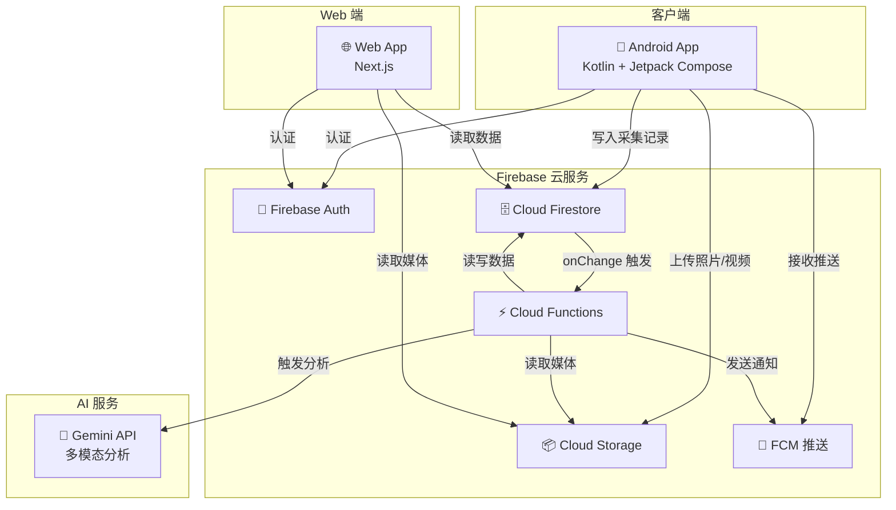
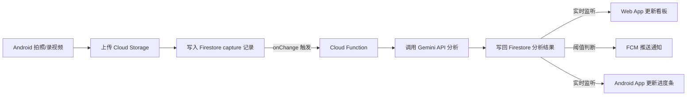
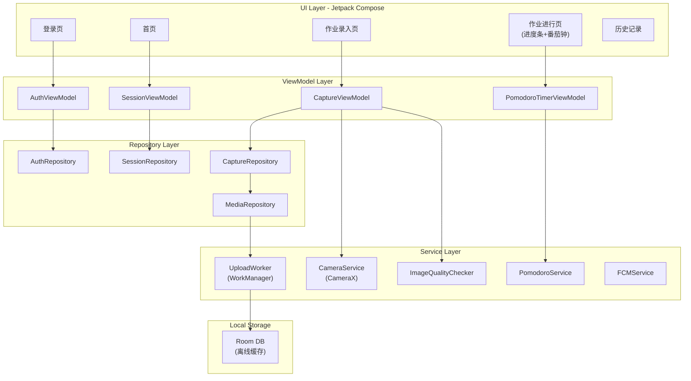

# 技术架构设计 — 小学生作业成长助手

> **版本**: v1.0  
> **日期**: 2026-03-17  
> **基于**: [产品规格说明书 v0.2](file:///Users/uo/ai/mobhomework/product_spec.md)

---

## 1. 整体系统架构



### 核心数据流



---

## 2. 技术栈选型

| 层级 | 技术 | 理由 |
|------|------|------|
| **Android App** | Kotlin + Jetpack Compose | 现代 Android 开发标准，声明式 UI |
| **Android 相机** | CameraX | Google 官方相机库，支持拍照+录像，简化生命周期 |
| **Android 本地存储** | Room + WorkManager | 离线缓存队列 + 后台上传任务 |
| **后端认证** | Firebase Auth | 已有账号体系，直接复用 |
| **数据库** | Cloud Firestore | 实时同步、离线支持、按文档付费 |
| **文件存储** | Cloud Storage for Firebase | 大文件（照片/视频）存储 |
| **云函数** | Cloud Functions (Node.js/TypeScript) | 事件驱动，Firestore onChange 触发 |
| **AI 分析** | Gemini 2.0 Flash API | 多模态（图片+视频），快速且成本低 |
| **推送通知** | Firebase Cloud Messaging (FCM) | Android + Web 统一推送 |
| **Web App** | Next.js + React | SSR/SSG 支持，与 Firebase 集成良好 |
| **Web 图表** | Recharts | 轻量级 React 图表库，用于效率趋势图 |

---

## 3. 数据模型设计（Firestore）

### 3.1 集合结构总览

```
users/{userId}
├── profile (文档字段)
├── settings (文档字段)
│
├── sessions/{sessionId}           // 每日作业 Session
│   ├── pages/{pageId}             // 录入的作业页
│   ├── questions/{questionId}     // 解析出的题目
│   ├── captures/{captureId}       // 定时采集记录
│   ├── analyses/{analysisId}      // AI 分析结果
│   └── events/{eventId}           // 事件日志（异常等）
```

### 3.2 文档 Schema 详述

#### `users/{userId}`

```json
{
  "displayName": "小明",
  "email": "parent@example.com",
  "role": "parent",
  "childName": "小明",
  "gradeLevel": 3,
  "createdAt": "2026-03-17T00:00:00Z",
  "settings": {
    "pomodoroWorkMinutes": 20,
    "pomodoroBreakMinutes": 5,
    "captureIntervalMinutes": 3,
    "lagThresholdQuestions": 3,
    "lagThresholdStallMinutes": 10,
    "notifications": {
      "significantLag": true,
      "sessionComplete": true,
      "prolongedLeave": true,
      "progressUpdate": false
    }
  }
}
```

#### `sessions/{sessionId}`

```json
{
  "userId": "uid_xxx",
  "date": "2026-03-17",
  "status": "in_progress",          // created | in_progress | completed
  "startedAt": "2026-03-17T16:30:00Z",
  "completedAt": null,
  "totalQuestions": 20,
  "completedQuestions": 12,
  "totalEstimatedMinutes": 45,
  "actualMinutes": null,
  "pomodoroCount": 0,
  "efficiencyStars": null,           // 1-5
  "aheadOfPlan": 2,                  // 正=领先, 负=落后
  "currentPageId": "page_003"
}
```

#### `pages/{pageId}`

```json
{
  "sessionId": "session_xxx",
  "pageIndex": 1,
  "subject": "语文",                  // AI 识别或用户标注
  "originalPhotoUrl": "gs://...",
  "thumbnailUrl": "gs://...",
  "uploadedAt": "2026-03-17T16:30:00Z",
  "questionsCount": 5,
  "status": "parsed"                  // uploading | parsing | parsed | error
}
```

#### `questions/{questionId}`

```json
{
  "sessionId": "session_xxx",
  "pageId": "page_001",
  "questionIndex": 3,
  "label": "语文-P12-第3题",
  "type": "fill_blank",              // fill_blank | choice | calculation | essay | copy | reading
  "estimatedMinutes": 2,
  "status": "completed",             // unanswered | in_progress | completed
  "statusUpdatedAt": "2026-03-17T16:45:00Z",
  "actualMinutes": 1.5,
  "difficulty": null,                // v2: easy | medium | hard
  "boundingBox": {                   // 题目在页面照片中的位置
    "x": 0.1, "y": 0.3,
    "width": 0.8, "height": 0.15
  }
}
```

#### `captures/{captureId}`

```json
{
  "sessionId": "session_xxx",
  "capturedAt": "2026-03-17T16:33:00Z",
  "photoUrl": "gs://...",
  "videoUrl": "gs://...",
  "photoBytesSize": 2048000,
  "videoDurationSeconds": 5,
  "quality": "good",                 // good | blurry | occluded | angle_shifted
  "deviceInfo": {
    "batteryLevel": 0.72,
    "isCharging": false
  },
  "analysisStatus": "completed"      // pending | processing | completed | skipped
}
```

#### `analyses/{analysisId}`

```json
{
  "captureId": "capture_xxx",
  "sessionId": "session_xxx",
  "analyzedAt": "2026-03-17T16:33:15Z",
  "matchedPageId": "page_001",
  "questionsProgress": [
    { "questionId": "q_001", "previousStatus": "in_progress", "newStatus": "completed" },
    { "questionId": "q_002", "previousStatus": "unanswered", "newStatus": "in_progress" }
  ],
  "overallProgress": {
    "completed": 12,
    "inProgress": 1,
    "unanswered": 7,
    "total": 20
  },
  "planComparison": {
    "expectedCompleted": 10,
    "actualCompleted": 12,
    "delta": 2,
    "status": "ahead"                // ahead | on_track | slightly_behind | significantly_behind
  },
  "anomalies": [],                   // ["stalled", "left_desk", "frequent_erasing"]
  "feedbackToChild": "太棒了，你超前了 2 题！",
  "feedbackToParent": null,          // null = 不打扰
  "geminiModelUsed": "gemini-2.0-flash",
  "processingTimeMs": 3200
}
```

#### `events/{eventId}`

```json
{
  "sessionId": "session_xxx",
  "type": "anomaly",                 // anomaly | milestone | pomodoro_complete | session_complete
  "subType": "stalled",              // stalled | left_desk | significant_lag | ahead_of_plan | ...
  "timestamp": "2026-03-17T16:50:00Z",
  "message": "已停滞 10 分钟",
  "notifiedParent": true,
  "notifiedChild": true
}
```

---

## 4. API 设计

### 4.1 Android → Cloud（通过 Firebase SDK 直接操作）

Android App 主要通过 Firebase SDK 直接读写 Firestore 和 Cloud Storage，无需自建 REST API。

| 操作 | 方式 | 说明 |
|------|------|------|
| 用户认证 | Firebase Auth SDK | 登录/注册 |
| 上传照片/视频 | Cloud Storage SDK | 上传到 `captures/{sessionId}/{captureId}/` |
| 创建 Session | Firestore SDK | 写入 `sessions` 集合 |
| 录入作业页 | Firestore SDK | 写入 `pages` 子集合 + 上传照片 |
| 写入采集记录 | Firestore SDK | 写入 `captures` 子集合 |
| 监听分析结果 | Firestore onSnapshot | 实时监听 `analyses` 和 `sessions` 变更 |
| 接收推送 | FCM SDK | 接收 Agent 发来的通知 |

### 4.2 Cloud Functions（事件驱动）

```
┌─────────────────────────────────────────────────────────┐
│  Cloud Functions (TypeScript)                           │
├─────────────────────────────────────────────────────────┤
│                                                         │
│  onPageCreated(pages/{pageId})                          │
│    → 调用 Gemini 解析题目                                │
│    → 写入 questions 子集合                               │
│    → 更新 session.totalQuestions                         │
│    → 生成预估计划                                        │
│                                                         │
│  onCaptureCreated(captures/{captureId})                  │
│    → 检查 quality 字段，跳过 occluded/blurry             │
│    → 从 Storage 获取照片+视频                            │
│    → 调用 Gemini 分析进度变化                            │
│    → 写入 analyses 子集合                                │
│    → 更新 session 进度字段                               │
│    → 计算 planComparison                                │
│    → 判断是否触发通知 → FCM                              │
│    → 写入 events（如有异常/里程碑）                       │
│                                                         │
│  onSessionCompleted(sessions/{sessionId})                │
│    → 生成作业总结报告                                    │
│    → 计算效率星级                                        │
│    → 推送完成通知                                        │
│                                                         │
│  scheduledCleanup (定时任务)                              │
│    → 清理过期的 Storage 文件                              │
│                                                         │
└─────────────────────────────────────────────────────────┘
```

### 4.3 Gemini API 调用策略

#### 作业解析（onPageCreated）

```typescript
// Prompt 策略
const parsePrompt = `
你是一个作业分析助手。请分析这张小学生作业页面的照片。

请识别出页面中的每一道题目，并返回 JSON 格式：
{
  "subject": "语文|数学|英语|...",
  "questions": [
    {
      "index": 1,
      "label": "简短描述，如：第一题 填空",
      "type": "fill_blank|choice|calculation|essay|copy|reading",
      "estimatedMinutes": 2,
      "boundingBox": { "x": 0.1, "y": 0.1, "width": 0.8, "height": 0.15 }
    }
  ]
}

注意：
- 以单道题目为最小颗粒度
- boundingBox 使用归一化坐标 (0-1)
- estimatedMinutes 基于小学生的平均速度预估
`;

// 调用
const result = await gemini.generateContent({
  model: "gemini-2.0-flash",
  contents: [
    { role: "user", parts: [
      { text: parsePrompt },
      { inlineData: { mimeType: "image/jpeg", data: photoBase64 } }
    ]}
  ],
  generationConfig: { responseMimeType: "application/json" }
});
```

#### 进度分析（onCaptureCreated）

```typescript
const progressPrompt = `
你是一个作业进度分析助手。

## 初始作业页面（参考基准）
[附上初始录入的照片]

## 当前采集照片
[附上最新采集的照片]

## 当前各题状态
${JSON.stringify(currentQuestionStatuses)}

请对比两张照片，判断各题目的完成状态变化。返回 JSON：
{
  "matchedPageId": "page_001 或 null（如不匹配任何已知页面）",
  "questionsProgress": [
    { "questionId": "q_001", "newStatus": "completed", "confidence": 0.95 }
  ],
  "anomalies": [],
  "sceneDescription": "孩子正在写第3题的答案"
}

注意：
- 如果照片模糊或被遮挡，confidence 设为低值，不要猜测
- anomalies 可选值: stalled, left_desk, frequent_erasing
- 铅笔字迹可能很浅，请仔细辨认
`;
```

---

## 5. Android App 模块设计



### 关键模块说明

| 模块 | 职责 |
|------|------|
| `CameraService` | 封装 CameraX，支持拍照 + 录像双模式，一次触发同时输出 |
| `ImageQualityChecker` | 本地图像质量检测：模糊（Laplacian 方差）、遮挡（像素变化率）、视角偏移（特征点匹配） |
| `UploadWorker` | WorkManager 后台任务，断网时缓存到 Room，恢复后按序上传 |
| `PomodoroService` | 前台 Service，管理番茄钟倒计时，支持后台运行 |
| `SessionViewModel` | 监听 Firestore 实时数据，驱动进度赛跑条 UI |

---

## 6. Web App 模块设计

```
web-app/
├── app/
│   ├── layout.tsx              // 全局布局
│   ├── page.tsx                // 首页/登录
│   ├── dashboard/
│   │   └── page.tsx            // 实时看板
│   ├── report/
│   │   ├── page.tsx            // 报告列表
│   │   └── [sessionId]/
│   │       └── page.tsx        // 单次作业详细报告
│   └── settings/
│       └── page.tsx            // 设置页
├── components/
│   ├── ProgressRaceBar.tsx     // 双轨进度赛跑条
│   ├── StatusBanner.tsx        // 一句话状态横幅
│   ├── EventStream.tsx         // 异常事件流
│   ├── QuestionList.tsx        // 题目列表
│   ├── PomodoroDisplay.tsx     // 番茄钟状态
│   ├── EfficiencyChart.tsx     // 效率趋势图 (Recharts)
│   ├── TimelineReplay.tsx      // 时间线回放
│   └── LatestCapture.tsx       // 最近采集照片
├── hooks/
│   ├── useSession.ts           // 实时监听当前 Session
│   ├── useAnalyses.ts          // 实时监听分析结果
│   └── useEvents.ts            // 实时监听事件
├── lib/
│   ├── firebase.ts             // Firebase 初始化
│   ├── auth.ts                 // 认证工具
│   └── notifications.ts        // Web Push 通知
└── styles/
    └── globals.css
```

### Web 端实时数据监听

```typescript
// useSession.ts - 核心 Hook
export function useSession(userId: string) {
  // 获取今日 session
  const todaySession = useFirestoreDoc(`users/${userId}/sessions`, {
    where: [["date", "==", today()]],
    orderBy: ["startedAt", "desc"],
    limit: 1
  });

  // 实时监听分析结果
  const analyses = useFirestoreCollection(
    `users/${userId}/sessions/${todaySession?.id}/analyses`,
    { orderBy: ["analyzedAt", "desc"], limit: 20 }
  );

  // 实时监听事件
  const events = useFirestoreCollection(
    `users/${userId}/sessions/${todaySession?.id}/events`,
    { orderBy: ["timestamp", "desc"] }
  );

  return { session: todaySession, analyses, events };
}
```

---

## 7. 部署与基础设施

| 组件 | 部署方式 | 说明 |
|------|----------|------|
| Android App | Google Play Store | 标准发布 |
| Cloud Functions | Firebase CLI deploy | `firebase deploy --only functions` |
| Firestore | Firebase 自动管理 | 配置安全规则 |
| Cloud Storage | Firebase 自动管理 | 配置生命周期策略（自动清理过期文件） |
| Web App | Vercel 或 Firebase Hosting | Next.js 推荐 Vercel 部署 |

### Firestore 安全规则（核心）

```javascript
rules_version = '2';
service cloud.firestore {
  match /databases/{database}/documents {
    // 用户只能访问自己的数据
    match /users/{userId} {
      allow read, write: if request.auth != null && request.auth.uid == userId;

      match /sessions/{sessionId} {
        allow read, write: if request.auth != null && request.auth.uid == userId;

        match /{subcollection}/{docId} {
          allow read, write: if request.auth != null && request.auth.uid == userId;
        }
      }
    }
  }
}
```

### Cloud Storage 生命周期

```json
{
  "lifecycle": {
    "rule": [
      {
        "action": { "type": "Delete" },
        "condition": { "age": 30 }
      }
    ]
  }
}
```

---

## 8. 项目目录结构

```
mobhomework/
├── README.md
├── product_spec.md
├── chat.md
├── technical_design.md
│
├── android/                        // Android App
│   ├── app/
│   │   ├── src/main/
│   │   │   ├── java/.../
│   │   │   │   ├── ui/             // Compose UI
│   │   │   │   ├── viewmodel/      // ViewModels
│   │   │   │   ├── repository/     // Repository layer
│   │   │   │   ├── service/        // Camera, Upload, Timer
│   │   │   │   ├── model/          // Data classes
│   │   │   │   └── util/           // ImageQualityChecker 等
│   │   │   └── res/
│   │   └── build.gradle.kts
│   └── build.gradle.kts
│
├── functions/                      // Cloud Functions
│   ├── src/
│   │   ├── index.ts                // 入口
│   │   ├── onPageCreated.ts        // 作业解析
│   │   ├── onCaptureCreated.ts     // 进度分析
│   │   ├── onSessionCompleted.ts   // 报告生成
│   │   ├── gemini/                 // Gemini API 封装
│   │   │   ├── client.ts
│   │   │   ├── prompts.ts
│   │   │   └── parser.ts
│   │   └── notifications.ts       // FCM 推送
│   ├── package.json
│   └── tsconfig.json
│
├── web/                            // Web App (Next.js)
│   ├── app/
│   ├── components/
│   ├── hooks/
│   ├── lib/
│   ├── styles/
│   ├── package.json
│   └── next.config.js
│
├── firebase.json                   // Firebase 配置
├── firestore.rules                 // 安全规则
├── storage.rules                   // Storage 规则
└── .firebaserc                     // 项目关联
```

---

## 9. 开发阶段规划

| 阶段 | 内容 | 预估时间 |
|------|------|----------|
| **Phase 1** | Firebase 项目初始化 + 认证 + 数据模型 | 1-2 天 |
| **Phase 2** | Cloud Functions + Gemini 集成（作业解析 + 进度分析） | 3-4 天 |
| **Phase 3** | Android App 核心（相机、录入、上传、进度条） | 5-7 天 |
| **Phase 4** | Web App 核心（看板、报告、设置） | 3-4 天 |
| **Phase 5** | 集成测试 + 优化 + 异常处理 | 2-3 天 |
| **Phase 6** | UI 打磨 + 番茄钟完善 + 激励系统 | 2-3 天 |

---

## 10. 验证计划

### 自动化测试

| 测试类型 | 范围 | 命令 |
|----------|------|------|
| Cloud Functions 单元测试 | Gemini prompt 解析、进度计算逻辑、通知阈值判断 | `cd functions && npm test` |
| Firestore 规则测试 | 安全规则验证 | `firebase emulators:exec --only firestore "npm test"` |
| Android 单元测试 | ImageQualityChecker、ViewModel 逻辑 | `cd android && ./gradlew test` |
| Web 组件测试 | ProgressRaceBar 渲染逻辑 | `cd web && npm test` |

### 集成验证（Firebase Emulator）

```bash
# 启动本地模拟器
firebase emulators:start --only functions,firestore,storage

# 模拟完整流程:
# 1. 写入 page 文档 → 验证 onPageCreated 触发 → 验证 questions 生成
# 2. 写入 capture 文档 → 验证 onCaptureCreated 触发 → 验证 analysis 生成
# 3. 验证进度计算和通知逻辑
```

### 手动验证

1. **Android 拍照流程**：安装 App → 创建 Session → 拍照录入 → 确认上传成功 → 确认 Gemini 解析出题目
2. **进度采集流程**：开启高拍仪模式 → 等待 3 分钟自动采集 → 确认照片+视频均上传 → 确认进度更新
3. **Web 看板实时性**：打开 Web App → Android 端触发采集 → 确认 Web 端进度条实时更新
4. **推送通知**：模拟进度明显落后 → 确认家长端（Web）收到推送通知
5. **离线恢复**：断开 Android 网络 → 拍照 → 恢复网络 → 确认积压数据补传

## User Review Required

> [!IMPORTANT]
> 以下决策需要确认：

1. **Firebase 项目**：是否已有 Firebase 项目，还是需要新建？需要哪个 GCP 区域？
2. **Gemini API Key**：是否已有 Gemini API 密钥？
3. **Web App 部署**：Vercel（推荐）还是 Firebase Hosting？
4. **Android 最低版本**：支持到 Android 多少？建议 API 26 (Android 8.0)
5. **开发优先级**：从哪个 Phase 开始？建议从 Phase 1（Firebase 基础设施）开始
